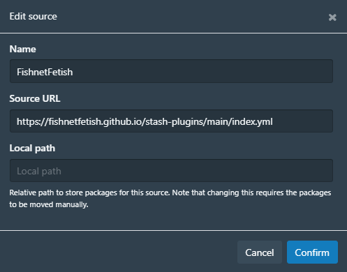

# MarkerClipper Plugin

A Stash plugin that adds clip buttons (✂️) next to scene markers, allowing users to extract video segments from markers with a single click.
By default, files will be exported to the stash/generated/clips directory, but this can be changed in the plugin's settings.

## Features

- One-Click Clipping: Click the ✂️ button next to any marker to extract that video segment
- Background Processing: Submits clip jobs to Stash's background task system
- FFmpeg Integration: Uses FFmpeg for high-quality video extraction

## Installation

In Settings > Plugins, under Available Plugins, click Add source: https://fishnetfetish.github.io/stash-plugins/main/index.yml


Under the new source, check markerClipper and press Install

## Known Limitations
- Requires ffmpeg available via Stash or override path.
- Markers without end_seconds default to 10s duration.
- Filename sanitization may alter special characters.

## Configuration

Settings available in Stash Settings > Plugins > markerClipper

## Usage

1. Navigate to a scene with markers.
2. Click the "Markers" tab.
3. Click ✂️ buttons next to markers to queue clips (or the ⚙️ gear for one-time Resolution/Preset/Bitrate overrides).
4. Monitor progress in Stash's Tasks section.

## Troubleshooting

If you don't see the clip_marker task running after clicking a ✂️ button, check the Stash Settings > Logs for possible errors.

### Python not found (Windows)

As noted by Stash Docs: https://docs.stashapp.cc/installation/windows/
```
As a result of running as administrator Stash might fail to detect your Python installation in PATH, 
so you need point it the correct way yourself after installation. 
In Settings > System and under Applications Paths header set Python Executable Path.
```

### ModuleNotFoundError: No module named 'stashapi'

Install the stashapp-tools module with the following command:
```pip install stashapp-tools```

### FFmpeg not found

From Stash Settings > System, click the "Download FFmpeg" button
Alternatively, set up your own FFmpeg installation and update the Stash paths for ffmpeg and ffprobe

## License

This plugin is provided as-is for Stash users. See Stash documentation for plugin development guidelines.
